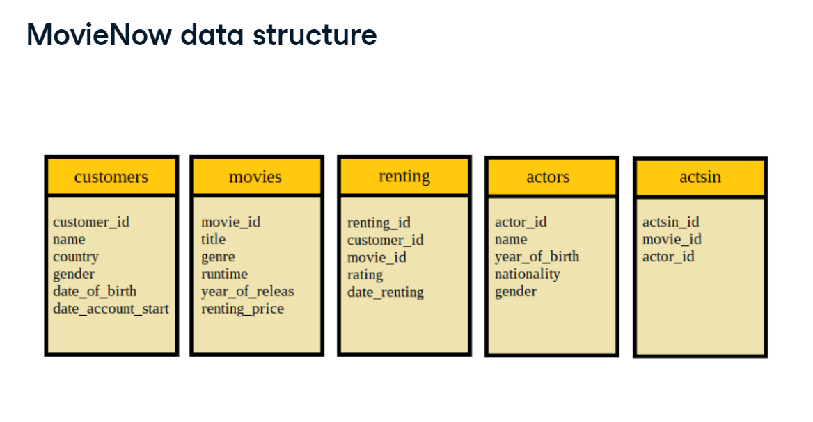

## MovieNow Analysis with SQL
I decided to explore the MovieNow Database on Datacamp. It is a database available for practice. I have been learning SQL on Datacamp since June 2023 and I have decided to begin to try out my SQL Skills. My name is Ayomide.

MovieNow is a fictional online video platform where customers are able to rent movies. The database contains the following tables;
___

For the purpose of this project, I set out to answer the following questions;
1. What is the total number of unique customers and distinct countries?
2. What is the total number of movies and distinct genres movies are listed in?
3. What is the total revenue MovieNow has generated?
4. What is the average, minimum and maximum renting price of movies available on MovieNow?
5. What is the average renting price by genre and how it compares to the overall average renting price of $2.21?.
6. Does renting price affect how movies are rented?

#### _Does rating affect how movies are rented?_
7. What is the average, minimum and maximum rating of all movies?
8. Which movie title(s) has a rating of 1?
9. Which movies have a perfect rating of 10?
10. Identify the top 10 movies with the most rentals and their average rating.
11. Do movies with the rating score of 10 have more rentals?

#### _Who are the customers of MovieNow?_
12. Who are our customers and where do they come from?
13. If MovieNow decides to reward it highest paying customer. Who would that customer be and what country would that customer be residing?.
14. Which country brings in the most revenue?
15. Which genre brings in the most revenue?

I answered the above questions with the use of SQL. The codes are available in the Answers_and_SOL_codes file just after this file you are reading.
You can read the full documentation on medium [here](https://medium.com/@ayomideanalyst/exploratory-data-analysis-with-sql-6ef87f061639)
