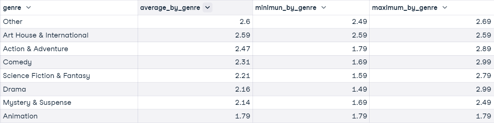

## ANSWERS
These are the SQL CODES written to answer the questions.
1. What is the total number of unique customers and distinct countries?
  ```sql
SELECT COUNT(DISTINCT customer_id) as total_customers,
        COUNT(DISTINCT country) AS total_countries
FROM movies.customers
```


2. What is the total number of movies and distinct genres movies are listed in?
```sql
SELECT COUNT(DISTINCT movie_id) AS total_movies,
   COUNT(DISTINCT genre) AS total_genre
FROM movies.movies
```


3. What is the total revenue MovieNow has generated?
```sql
-- How much has MovieNow made from renting movies?
SELECT SUM(renting_price) AS total_revenue
FROM movies.renting AS r
LEFT JOIN movies.movies AS m
ON r.movie_id = m.movie_id
```


4. What is the average, minimum and maximum renting price of movies available on MovieNow?
```sql
-- What is the average, minimum and maximum renting price of all movies rounded to two decimal places?
SELECT ROUND(AVG(renting_price),2) AS average_price,
 ROUND(MIN(renting_price), 2) AS minimun_price,
 ROUND(MAX(renting_price), 2) AS maximum_price
FROM movies.movies
```


5. What is the average renting price by genre and how it compares to the overall average renting price of $2.21?.
```sql
-- What is the average, minimum and maximum renting price by genre? 
-- How does it compare to overall average renting price?
SELECT genre AS genre,
 ROUND(AVG(renting_price),2) AS average_by_genre,
 ROUND(MIN(renting_price), 2) AS minimun_by_genre,
 ROUND(MAX(renting_price), 2) AS maximum_by_genre
FROM movies.renting AS r -- Join renting and movies tables
LEFT JOIN movies.movies AS m
ON m.movie_id = r.movie_id
GROUP BY genre
ORDER BY average_by_genre DESC
```


6. Does renting price affect how movies are rented?
```sql
-- Does renting price affect how often movies are rented?
SELECT genre AS genre,
 ROUND(AVG(renting_price),2) AS average_price_by_genre,
 COUNT(r.*) AS movies_rented
FROM movies.renting AS r -- Join renting and movies tables
LEFT JOIN movies.movies AS m
ON m.movie_id = r.movie_id
GROUP BY genre
ORDER BY average_price_by_genre DESC
```


#### _Does rating affect how movies are rented?_
7. What is the average, minimum and maximum rating of all movies?
```sql
-- Are our customers satisfied?
-- What is the average, minimum and maximum rating of all movies?
SELECT ROUND(AVG(rating),2) AS average_rating,
 MIN(rating) AS minimum_rating,
 MAX(rating) AS maximum_rating
FROM movies.renting
```


8. Which movie title(s) has a rating of 1?
```sql
SELECT title AS movie_title,
 genre as genre,
 year_of_release AS released_year
FROM movies.movies
WHERE movie_id IN
    (SELECT movie_id --this subquery identifies the movie_id with a rating of 1
    FROM movies.renting
    WHERE rating = 1)
```


9. Which movies have a perfect rating of 10?
```sql
-- Let's identify movie title with the perfect rating of 10
SELECT title AS movie_title,
 genre as genre,
 year_of_release AS released_year
FROM movies.movies
WHERE movie_id IN
    (SELECT movie_id --this subquery identifies the movie_id with a rating of 10
    FROM movies.renting
    WHERE rating = 10)
ORDER BY released_year DESC
```


10. Identify the top 10 movies with the most rentals and their average rating.
```sql
-- Identify the top 10 movies with the most rentals and their average rating
SELECT r.movie_id,
 title, 
 COUNT(r.*) AS total_rent,
 ROUND(AVG(rating),2) AS avg_rating
FROM movies.renting AS r
LEFT JOIN movies.movies AS m
ON r.movie_id = m.movie_id
GROUP BY r.movie_id, title
ORDER BY total_rent DESC
LIMIT 10
```


11. Do movies with the rating score of 10 have more rentals?
```sql
-- Do movies with the rating score of 10 have more rentals?
SELECT r.movie_id,
 title, 
 COUNT(r.*) AS total_rent,
 AVG(rating) as avg_rating
FROM movies.renting AS r
LEFT JOIN movies.movies AS m
ON r.movie_id = m.movie_id
WHERE rating = 10
GROUP BY r.movie_id, title
ORDER BY total_rent DESC
```


#### _Understanding the customers of MovieNow?_
12. Who are our customers and where do they come from?
```sql
-- Who are our customers and where do they come from?
SELECT country,
 COUNT(*) AS total_customers
FROM movies.customers
GROUP BY country
ORDER BY COUNT(*) DESC
```
  

13. If MovieNow decides to reward it highest paying customer. Who would that customer be and what country would that customer be residing?.
```sql
--Who is the highest paying customer and where does this customer reside?
SELECT c.name,
 c.country,
 SUM(renting_price) AS total_amount_paid
FROM movies.renting AS r
 LEFT JOIN movies.movies AS m
 ON r.movie_id = m.movie_id
 LEFT JOIN movies.customers AS c
 ON r.customer_id = c.customer_id
GROUP BY c.name, c.country
ORDER BY total_amount_paid DESC
LIMIT 1
```


14. Which country brings in the most revenue?
```sql
-- Which country brings in the most revenue?
SELECT c.country,
 SUM(m.renting_price) AS revenue_by_country
FROM movies.renting AS r
 LEFT JOIN movies.movies AS m
 ON r.movie_id = m.movie_id
 LEFT JOIN movies.customers AS c
 ON r.customer_id = c.customer_id
GROUP BY c.country
ORDER BY revenue_by_country DESC
LIMIT 1
```


15. Which genre brings in the most revenue?
```sql
-- Which genre brings in the most revenue?
SELECT genre,
 SUM(renting_price) AS revenue_by_genre
FROM movies.renting AS r
LEFT JOIN movies.movies AS m
ON r.movie_id = m.movie_id
GROUP BY genre
ORDER BY revenue_by_genre DESC
LIMIT 1
```

